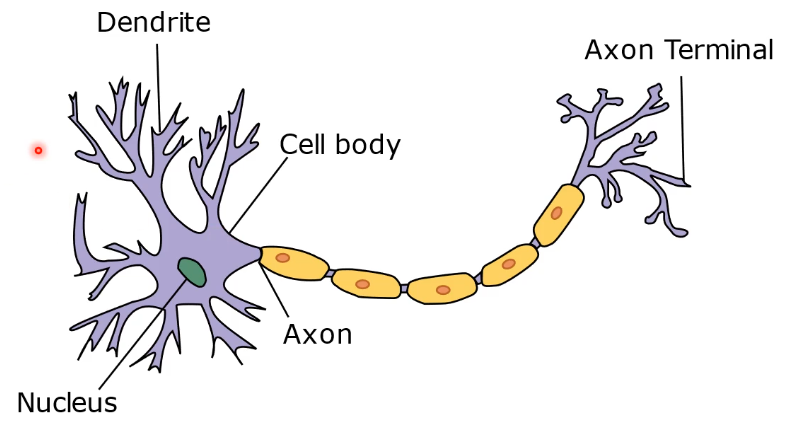
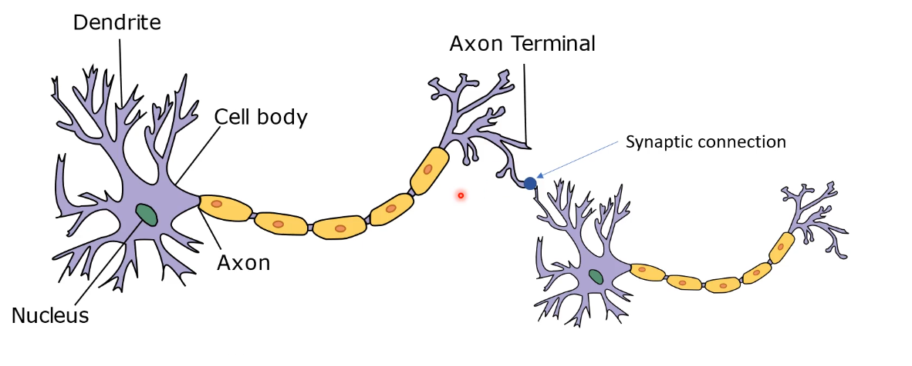
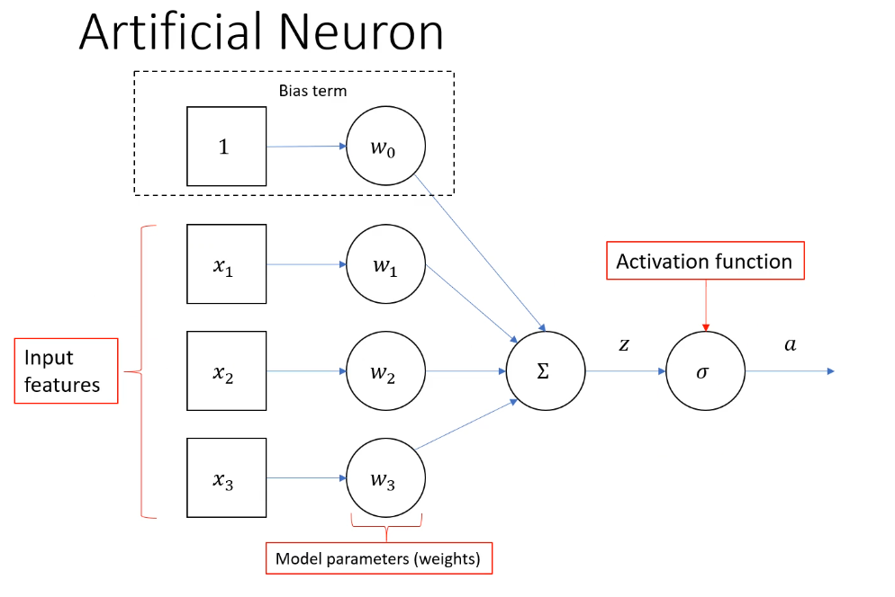
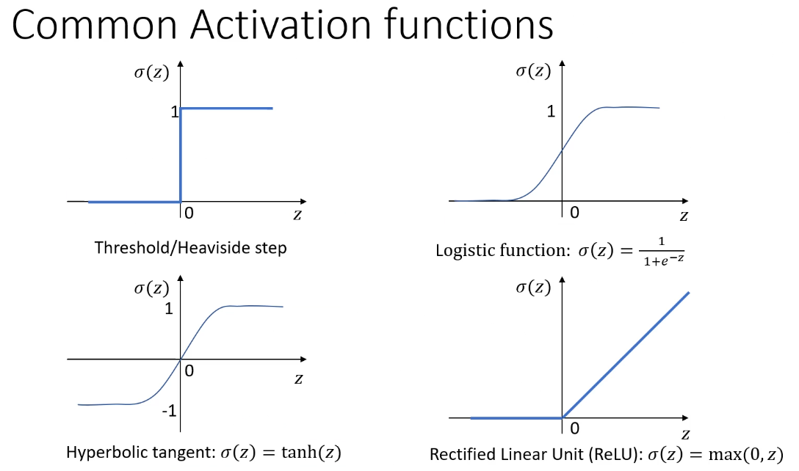

# Neural Networks

*Inspired by biological neurons*
<a name="neuron">

- nucleus sums all the incoming signals
- if the summation exceeds a certain threshold, the neuron will be activated (fire)
- electrical signal will travel down the exon

<a name="network">
- we can connect neurons to create network of neurons
- synaptic strength determines how strongly some neurons affect others 

<a name="an">
- illustration of an artificial neuron
-   
- sigma is an activation function

<a name="network">
- Rectified linear unit is the most commonly used in modern ANNs