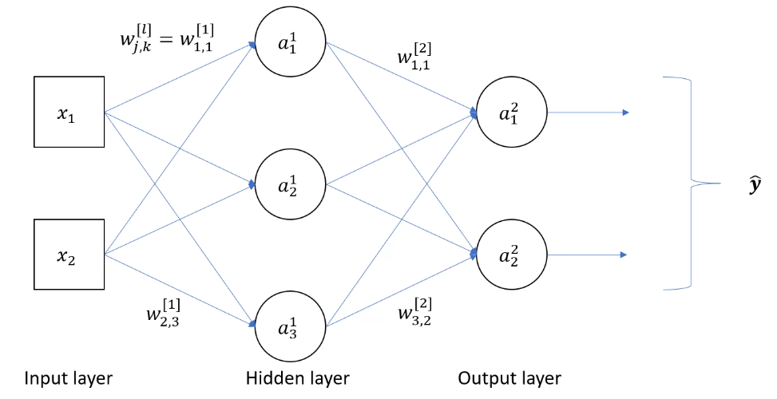
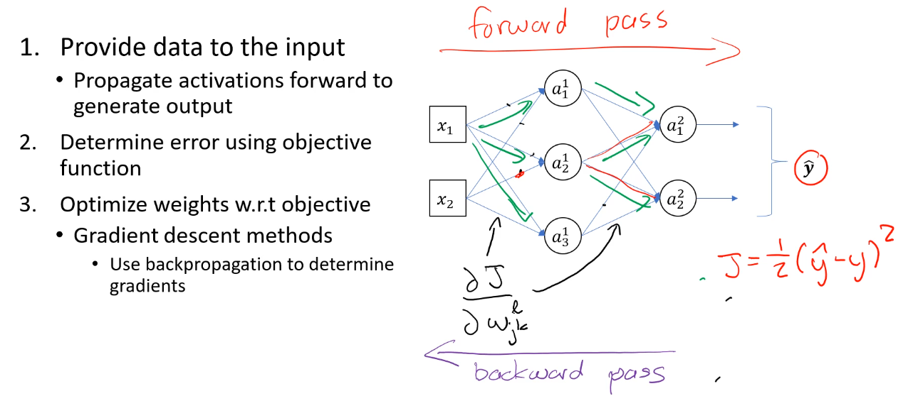

# Multi-layer Neural Networks

<a name="ann">
- Fully connected/Dense network : Each neuron in a given later is connected to every neuron in the next layer
- Number of hidden layers corresponds to the depth of the network
- Feed-forward : network only works in the forward direction

## Importance of Depth
- Necessary to create non-linear outputs
- While the output of a single layer network may be non-linear, the decision boundary it creates is linear

## Training Operation
<a name="training">