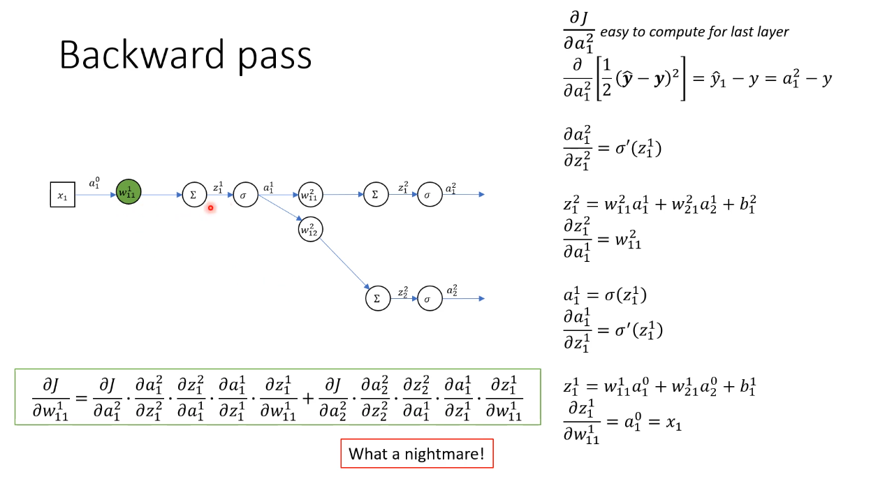
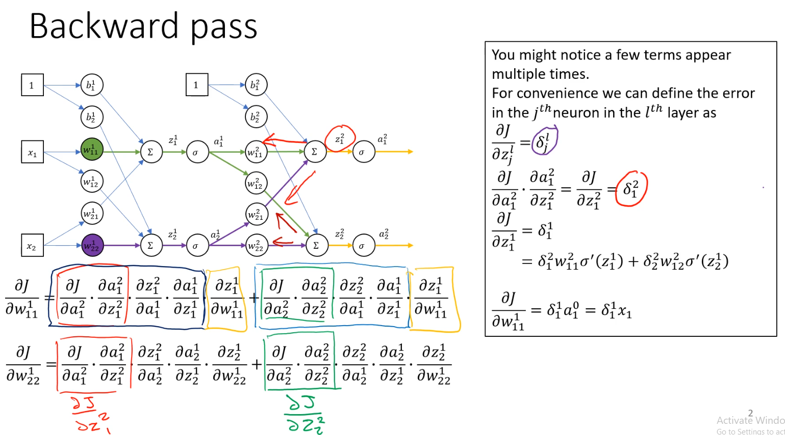
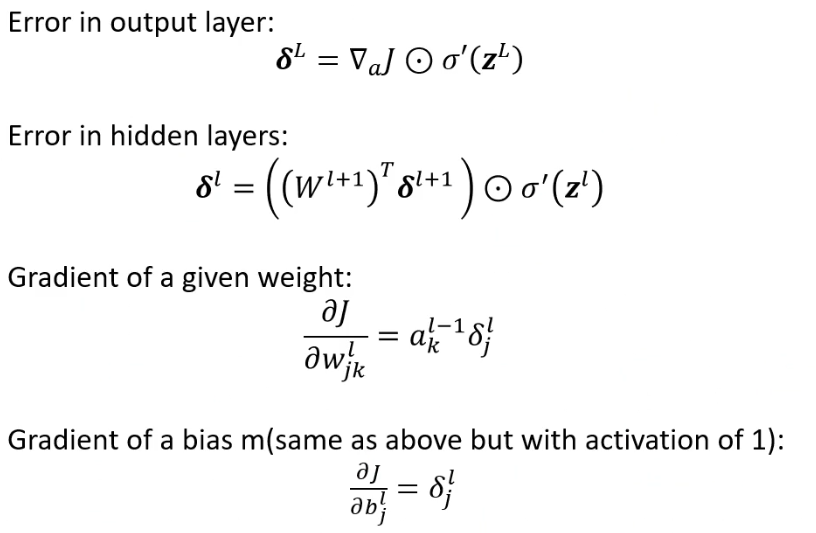
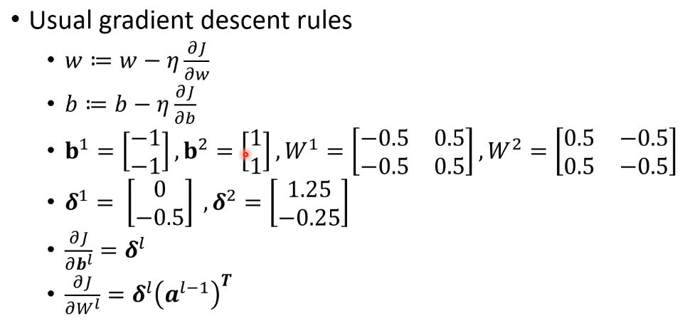

# Back Propagation

This involves finding the gradient for each weights and applying gradient descent
- Allows us to calculate error from froward pass and determining gradients via chain rule

    
    

- Weights propagate through all connected neurons and finally towards the output value
- It seems that adding more layers will add more complexity

<a name="backward_pass">

## Simplification

<a name="backward_pass_1">

## Backward Propagation Equations

<a name="backward_pass_2">

## Update Parameters

<a name="grad_desc_rules">
