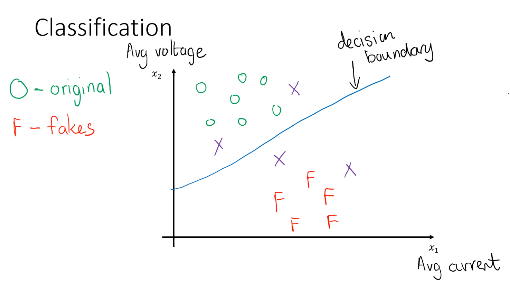
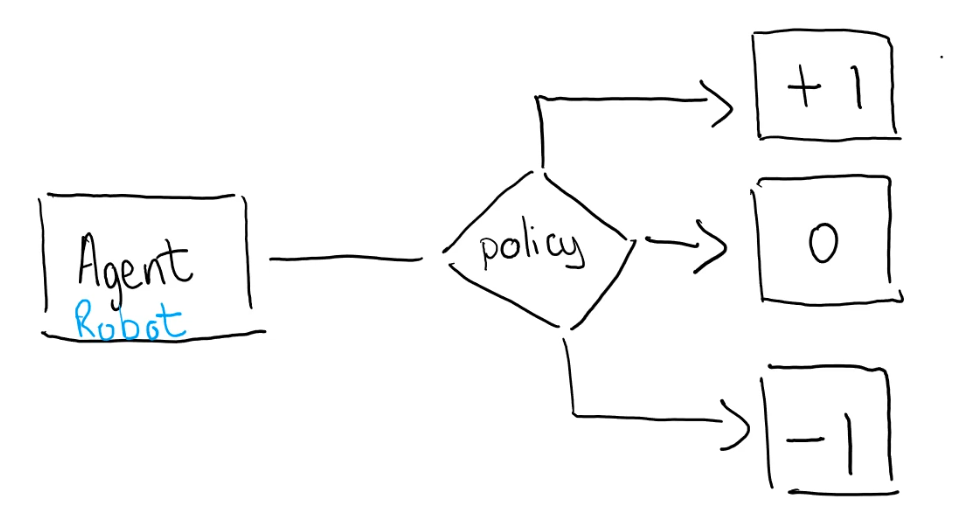

# Learning Tasks

1. Classification
    - How do we categorize data into discrete classes
2. Regression
    - Given a specific input, what real value response do we require?
3. Clustering
    - Grouping similar entities
4. Reinforcement Learning
    - Selecting certain actions to produce specific output

## 1.Classification

<a name="classification">

In the example above, we are able to distinguish between original and fake power supplies by looking at average voltage and current. 
Generally, we would want a decision boundary with which we can separate the data. This might not be a linear relationship in practice.

## 2.Regression
Regression tasks try to predict a real value for a given set of inputs. This may work by trying to fit data to a line of best fit.

## 3.Clustering
Clustering involves input that is not labeled. I.e. we do not necessarily know what the the data represents. But we can try and group data 
points together into clusters by determining how similar the data points are. This will be done according to a similarity metric.

## 4.Reinforcement Learning
For now, think of this as a task involving predicting how to act to maximize some reward. In the example below, think about
trying to find the best policy to produce on of the outcome behaviors.
<a name="RL">