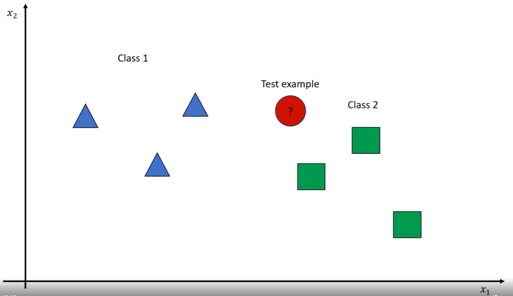

# Nearest Neighbor Algorithms

## Supervised Learning
1. **Classification**
2. Regression - simple and easy to implement. Presumption that data fits linear model is limiting.

**parametric model** = types of algorithm that makes assumptions of form of the solution

## Classification

*We will be focusing on nearest k neighbor algorithm (KNN)*:
- Lazy approach to learning
- Training data used during testing (similar to open boot test)
- Alternative is **eager** learning - training data not used during testing

<a name="knn_example1">

The above image shows an example of knn. For knn we need:
- Distance metric to find how similar input vectors are. This can be simple euclidean metric
- k nearest neighbors for a point
- Classify new point with neighbors which it is most similar to

**The Scenario**
 
Suppose we have some target function   
where  and  is the number of classes  
 where m is the number of features (dimensionality).

Training set 
- 
- these are input and label pairs
K-Nearest Neighbors
- 
- need to know the distance metric to determine distances
Classification
- 
Regression
- 

## Pros and Cons
- Easy to implement
- No assumptions about the data
- Limited by memory constraints
- Computationally complex
    - O(n x m)
    - n = # number of training examples
    - m = # of features
    - Assuming n>>m O(n)
- Curse of Dimensionality 