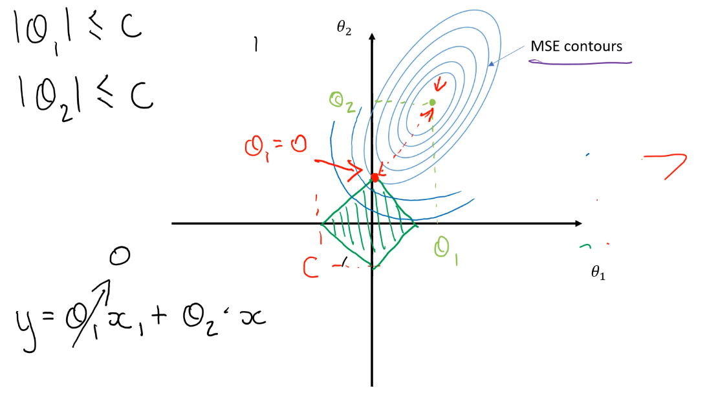
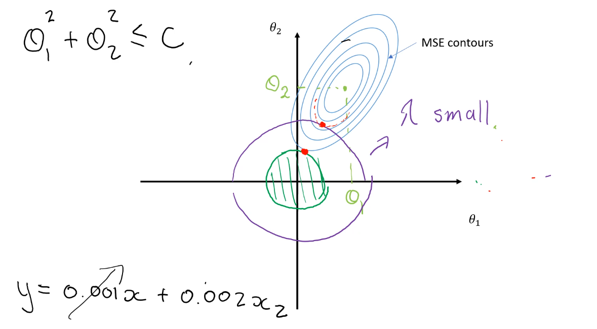

# Regularization 
*General idea is to constrain the parameters so that they tend towards zero, results in less complex models*

- Constraint parameters
    - Small Values
    - Reduced complexity
- Embedded in the algorithms

    
- Small value of x2 results in feature vanishing

## l1 Regularization
- For linear models : LASSO (Least Absolute Shrinkage and Selection Operator) Regression
- l1 penalty: 
- Sum of the absolute values of each of the parameters
- Add to objective function
- 
- Goal is to minimize objective function
- Additional term here creates a boundary

<a name="l1reg">

## l2 Regularization
- For linear models: Ridge Regression
- l2 penalty:
- Add to objective function
- 
- Minimizing MSE under a constraint
- Small values of lambda cause the circle to increase
- The larger the value of lambda, the smaller the circle. This leads to coefficients closers to zero and a less complex model
- Intersection point is less likely to happen to at intersects, we therefore are able to keep some model complexity as parameters are not completely eliminated

<a name="l2reg">